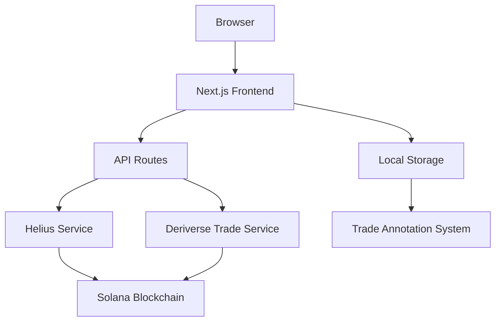

# Deriverse Architecture Documentation

## System Overview

Deriverse is a trading analytics platform built on Next.js that provides comprehensive analysis of Solana blockchain trading activity.

## Architecture Flow



## Component Architecture

### Frontend Layer
```
src/
├── app/                    # Next.js App Router
│   ├── globals.css        # Global styles
│   ├── layout.tsx         # Root layout
│   └── page.tsx           # Home page
├── components/            # React components
│   ├── features/         # Business logic components
│   │   ├── Home.tsx      # Main dashboard
│   │   ├── Journal.tsx   # Trade annotation system
│   │   └── TradeHistory.tsx # Wallet transaction viewer
│   ├── layout/           # Structural components
│   └── ui/               # Atomic UI components
├── lib/                  # Business logic & utilities
│   ├── mockData.ts      # Mock trade generation
│   ├── tradeFilters.ts  # Date filtering logic
│   └── types.ts         # TypeScript definitions
└── services/            # External API clients
    ├── HeliusService.ts # Solana data API
    └── DeriverseTradeService.ts # Trading data processing
```

## Data Flow

### 1. Trade Data Pipeline
```
Mock Data → Trade Filters → Components → UI Display
```

### 2. Real-time Data Pipeline (Future)
```
Solana Blockchain → Helius API → Service Layer → Components → UI Display
```

### 3. Annotation System
```
User Input → Local Storage → Markdown Export → Download
```

## Technology Stack

### Frontend
- **React 19**: Component framework with hooks
- **Next.js 16**: Full-stack React framework
- **TypeScript**: Type safety and development experience
- **TailwindCSS**: Utility-first CSS framework

### Data Layer
- **Mock Data**: Deterministic trade generation for development
- **Local Storage**: Client-side annotation persistence
- **Future APIs**: Helius (Solana data), Deriverse (trading analytics)

### UI Components
- **Radix UI**: Accessible component primitives
- **Lucide React**: Icon library
- **Recharts**: Data visualization
- **Custom Components**: Trading-specific UI elements

## State Management

### Current Approach
- **React Hooks**: `useState`, `useMemo` for local state
- **Prop Drilling**: Component-to-component data flow
- **No Global State**: Simple, predictable data flow

### State Categories
1. **Filter State**: Time filters, date ranges, wallet selection
2. **UI State**: Modal visibility, pagination, active tabs
3. **Data State**: Trade data, annotations, loading states

## API Architecture

### Current APIs
- **Mock Data Service**: Development data generation
- **Annotation Storage**: Local storage interface

### Planned APIs
- **Helius Service**: Solana blockchain data
  - Transaction history
  - Account activity
  - Token transfers
- **Deriverse Service**: Trading analytics
  - PnL calculations
  - Trade execution data
  - Fee breakdowns

## Component Communication

### Parent-Child Flow
```
Home (Parent) → TopBar (Child) → Filter Updates → Home Re-render
```

### Data Flow Pattern
1. **Data Fetching**: Parent components fetch data
2. **State Management**: Local state with React hooks
3. **Prop Passing**: Data flows down through props
4. **Event Bubbling**: User actions bubble up through callbacks

## File Structure Patterns

### Feature-based Organization
- Each major feature has its own directory
- Components, utilities, and types co-located
- Clear separation of concerns

### Naming Conventions
- **Components**: PascalCase (e.g., `TradeHistory.tsx`)
- **Utilities**: camelCase (e.g., `tradeFilters.ts`)
- **Types**: PascalCase (e.g., `Trade.ts`)

## Performance Considerations

### Current Optimizations
- **useMemo**: Expensive calculations cached
- **React.memo**: Component re-render prevention
- **Code Splitting**: Dynamic imports for large components

### Future Optimizations
- **Virtual Scrolling**: Large data sets
- **Data Caching**: API response caching
- **Lazy Loading**: Component-level lazy loading

## Security Considerations

### Current Security
- **Client-side Only**: No server-side data processing
- **Local Storage**: Annotations stored locally
- **Input Validation**: Form validation and sanitization

### Future Security
- **API Keys**: Secure storage of API credentials
- **Rate Limiting**: API request throttling
- **Data Privacy**: User data protection measures

## Deployment Architecture

### Development
- **Local Development**: Next.js dev server
- **Mock Data**: Deterministic test data
- **Hot Reload**: Fast development iteration

### Production
- **Static Generation**: Pre-built pages where possible
- **Server Components**: Hybrid rendering strategy
- **CDN Distribution**: Global content delivery

## Scalability Considerations

### Current Limitations
- **Mock Data**: Limited data variety
- **Client Processing**: Heavy computations on client
- **Single User**: No multi-user support

### Future Scaling
- **API Integration**: Real blockchain data
- **Server Processing**: Heavy calculations server-side
- **Multi-tenancy**: Multiple user support
- **Database Integration**: Persistent data storage

## Development Workflow

### Component Development
1. **Type Definitions**: Define interfaces first
2. **Component Structure**: Build UI components
3. **Business Logic**: Add data processing
4. **Integration**: Connect to data sources
5. **Testing**: Verify functionality

### Code Organization
- **Imports**: External libraries first, then internal
- **Exports**: Named exports for utilities, default for components
- **Constants**: Upper snake case for constants
- **Functions**: camelCase for functions

This architecture supports rapid development while maintaining flexibility for future scaling and real-world data integration.
