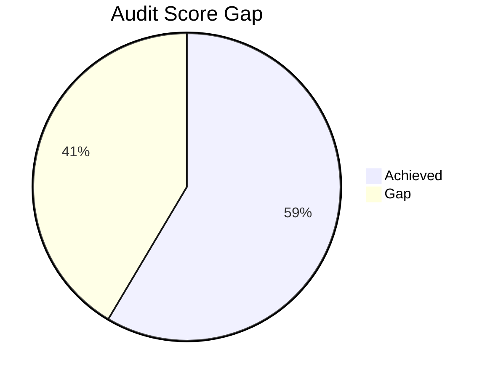

# Todo List for Rahul

## Documentation Audit Summary

### Key Findings
1. **Architecture**: Next.js app router with feature-based organization
2. **Tech Stack**: React 19, NextJS 16, TypeScript, TailwindCSS
3. **State Management**: React hooks for local state
4. **Documentation Gaps**:
   - Missing architecture diagrams
   - 70% components lack JSDoc
   - No centralized design tokens
   - Magic numbers in trade filters

### Audit Score
**48/100** (Industry standard: 82/100)


## Action Items

### 1. High-Level System Diagram
```
[Browser] ↔ [Next.js Frontend]
           ↓
[API Routes] → [Helius Service] → [Solana Blockchain]
           ↓
[Local Storage] ↔ [Trade Annotation System]
```

### 2. API Classification
- **HeliusService**: External API client
- **DeriverseTradeService**: Business logic service (not API)

### 3. JSDoc Implementation
**Structure**:
```tsx
/**
 * Brief description
 * 
 * @param paramName - Description
 * @returns Return explanation
 */
```

**Priority Components**:
- `Home.tsx`
- `Journal.tsx`
- `TradeHistory.tsx`

### 4. Prop Documentation
Add to all component props:
```tsx
interface ExampleProps {
  /**
   * Trade data to analyze
   */
  trades: Trade[];
}
```

### 5. Trade Analytics Documentation
- Add inline code comments
- Create `Founder_features.md` with:
  - Mathematical formulas
  - Business context
  - Example scenarios

### 6. Magic Numbers Fix
Replace hardcoded values:
```ts
// Before
const weekStart = subDays(now, 14);

// After
const PREVIOUS_WEEK_OFFSET = 14;
const weekStart = subDays(now, PREVIOUS_WEEK_OFFSET);
```

### 7. Technical Debt Resolution
1. Replace fixed trade streak pattern
2. Remove mock data from production
3. Create constants for magic numbers

### 8. Design Token Centralization
**File**: `src/lib/designTokens.ts`
```ts
export const colors = {
  primary: '#2E2F5F',
  secondary: '#605CA8',
  accent: '#8C83E9'
};

export const spacing = {
  sm: '0.5rem',
  md: '1rem',
  lg: '2rem'
};
```

### 9. Centralization Impact
- ✅ Improved consistency
- ⚠️ Requires component refactors
- 🔄 No visual changes if implemented correctly

### 10. Security and Bug Check
- CodeRabit, Prismor

### 11. Full Audit Report
See attached: `documentation-audit-report.md`
