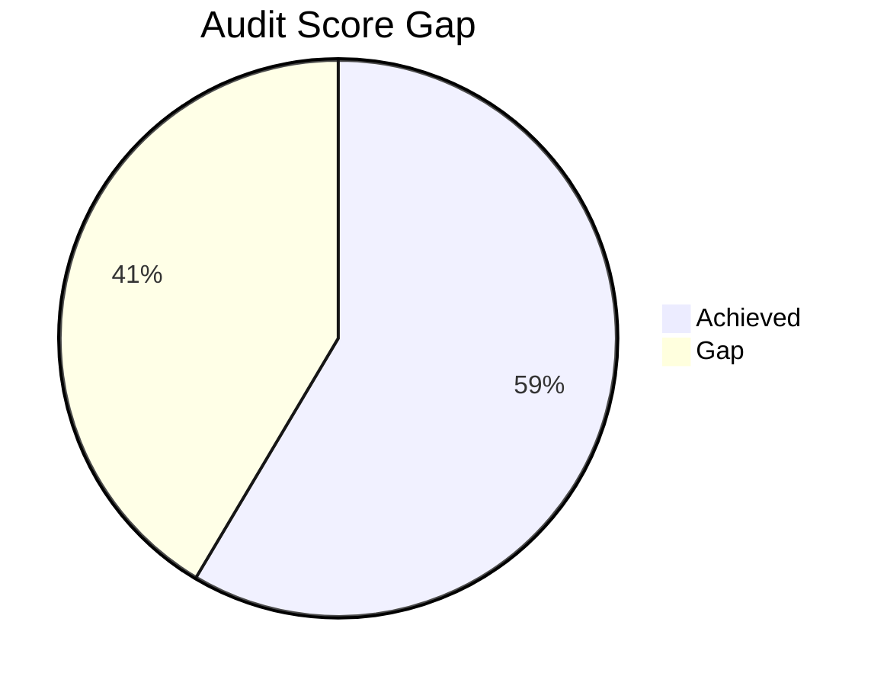

# Future Enhancements - Todo List

## Priority 1: Load Cached Trades

### Goal
Show cached trades instantly without fetching from blockchain every time.

### Why This Matters
- **⚡ Performance**: Instant load (no RPC calls needed)
- **💰 Cost Savings**: Reduces expensive RPC calls to Helius/Solana
- **📊 Reliability**: Historical data always available, even if RPC is down
- **🔄 Better UX**: Show cached data immediately, then offer refresh option

### Implementation Approach
1. **Check Database First**
   - When user enters wallet address, query `trades` table first
   - If trades exist, display them immediately
   - Show "Last synced X hours ago" indicator

2. **Add Refresh Button**
   - Replace "Run Lookup" with "Refresh" when cached data exists
   - Re-fetch from blockchain on user request
   - Update `last_synced_at` in `user_wallets` table

3. **Smart Loading**
   ```typescript
   // Pseudocode
   const cachedTrades = await tradeService.getTrades(address);
   if (cachedTrades.length > 0) {
     setDeriverseTrades(cachedTrades);
     setDataSource('cache');
   } else {
     // Fetch from blockchain
   }
   ```

### Estimated Effort
- 15-20 minutes implementation
- Immediate value for users


---

## Priority 2: Mock to Real Data UX Flow

### Goal
Create a seamless transition for users from viewing mock data to seeing their own real trading analytics.

### Why This Matters
- **🌉 Bridge the Gap**: Clear path from "What is this?" (Mock) to "This is mine" (Real)
- **🧠 Clarity**: Users always know if they are looking at sample data or their own data
- **🤝 Call to Action**: Encourage users to import their trades to see the value
- **🔄 User Choice**: Respect user's decision to stay in "exploration mode" or switch to "analytics mode"

### User Journey
1. **Landing**: User sees Dashboard/Journal with **Mock Data** + Banner explaining it's mock data.
2. **Action**: Banner has "Go to Wallet Lookup" button.
3. **Lookup**: User goes to Wallet tab, fetches trades (manual or connected).
4. **Save**: User clicks "Save Trades".
5. **Confirmation**: Modal appears: "Trades Saved! View Analytics?"
   - **Yes**: Switch network to "Devnet" (Real Data mode) -> Go to Dashboard -> Show Real Charts.
   - **No**: Stay on Lookup page.
6. **Persistence**: Network selector "On Devnet" = Real Data, "On Mock Data" = Mock Data.

### Key Components
1. **Mock Data Banner**:
   - Reusable component for Dashboard/Journal.
   - Distinct visual style (e.g., Yellow/Info variant).
   - "You are viewing sample data. Fetch your trades to see real analytics."

2. **Analytics Confirmation Modal**:
   - Triggered after successful save in `TradeHistory`.
   - Clear binary choice: "View Analytics" vs "Dismiss".

3. **Data Mode Integration**:
   - Tie `network` state ('mock' vs 'devnet') to data sourcing in `Home` and `Journal`.
   - 'mock' -> `MOCK_TRADES`
   - 'devnet' -> `SupabaseTradeService.getTrades()`

### Estimated Effort
- 45-60 minutes
- High impact on user activation


### Features to Build
1. **PnL Chart Over Time**
   - Line chart showing cumulative PnL
   - Use Recharts (already in project)
   - Query: `SELECT closed_at, SUM(pnl) OVER (ORDER BY closed_at) as cumulative_pnl`

2. **Win Rate Visualization**
   - Pie chart or donut chart
   - Winning vs losing trades
   - Percentage display

3. **Performance by Symbol**
   - Bar chart comparing different trading pairs
   - Total PnL per symbol
   - Win rate per symbol

4. **Daily/Weekly Performance**
   - Heatmap or bar chart
   - Identify best trading days
   - Pattern recognition

5. **Best/Worst Trades Display**
   - Table showing top 10 winners and losers
   - Link to transaction on Solscan
   - Highlight patterns

### Implementation Approach
- Create new `Analytics` tab in navigation
- Use existing Recharts library
- Query cached trades from Supabase
- Real-time calculations (no backend needed)

### Estimated Effort
- 1-2 hours for basic dashboard
- Can iterate and add features over time

---

## Priority 3: Trade Annotations System

### Goal
Let users add notes, tags, and lessons learned to individual trades.

### Why This Matters
- **📝 Learning**: Document what worked and what didn't
- **🏷️ Organization**: Tag trades by strategy, setup, emotion
- **💡 Improvement**: Review past mistakes and successes
- **🔍 Filtering**: Find trades by tag or note content

### Features to Build
1. **Add Notes to Trades**
   - Text area for each trade
   - Save to database
   - Display in trade details

2. **Tagging System**
   - Predefined tags: "revenge trade", "good setup", "FOMO", "patience"
   - Custom tags
   - Multi-tag support

3. **Lessons Learned**
   - Dedicated field for key takeaways
   - Display in journal view

4. **Filter by Tags**
   - Show all trades with specific tag
   - Analyze performance by tag
   - Example: "How do my 'revenge trades' perform?"

### Database Schema
```sql
CREATE TABLE trade_annotations (
  id UUID PRIMARY KEY DEFAULT gen_random_uuid(),
  trade_id TEXT NOT NULL REFERENCES trades(id) ON DELETE CASCADE,
  notes TEXT,
  tags TEXT[], -- Array of tags
  lessons_learned TEXT,
  created_at TIMESTAMPTZ NOT NULL DEFAULT NOW(),
  updated_at TIMESTAMPTZ NOT NULL DEFAULT NOW()
);
```

### Migration from localStorage
- Current annotations stored in localStorage
- Migrate to database for persistence
- Sync across devices

### Estimated Effort
- 30-45 minutes for basic implementation
- Additional time for UI polish

---

## Priority 4: Multi-Wallet Management

### Goal
Track multiple wallets and compare performance across them.

### Why This Matters
- **👛 Organization**: Manage multiple trading accounts
- **📊 Comparison**: Compare performance across wallets
- **🔄 Flexibility**: Easy switching between wallets
- **📈 Portfolio View**: Combined analytics across all wallets

### Features to Build
1. **Save Multiple Wallets**
   - Already have `user_wallets` table
   - Add wallet nickname/label
   - Store wallet metadata

2. **Wallet Selector**
   - Dropdown to switch between saved wallets
   - Show wallet nickname + truncated address
   - Quick access to recent wallets

3. **Compare Wallet Performance**
   - Side-by-side comparison
   - Total PnL per wallet
   - Win rate per wallet
   - Best performing wallet

4. **Combined Analytics**
   - Portfolio-level metrics
   - Total across all wallets
   - Use existing multi-wallet SQL query

### Implementation Approach
- Use existing `user_wallets` table
- Add wallet management UI
- Extend analytics to support multi-wallet view

### Estimated Effort
- 45-60 minutes for basic implementation
- Foundation already exists (database schema ready)

---

## Additional Ideas (Lower Priority)

### 5. Export Trades to CSV
- Download trades for tax reporting
- Excel-compatible format
- Filter by date range

### 6. Trade Alerts/Notifications
- Alert when PnL crosses threshold
- Daily/weekly summary emails
- Browser notifications

### 7. Strategy Tracking
- Tag trades by strategy
- Compare strategy performance
- Identify best strategies

### 8. Social Features
- Share trade performance (anonymously)
- Leaderboards
- Community insights

---

## Implementation Order Recommendation

1. **Load Cached Trades** (15-20 min) - Immediate value
2. **Multi-Wallet Management** (45-60 min) - Foundation for growth
3. **Analytics Dashboard** (1-2 hours) - High engagement
4. **Trade Annotations** (30-45 min) - Learning tool

**Total Estimated Time:** 3-4 hours for all priority features

---

## Technical Notes

### Already Implemented ✅
- `user_wallets` table with foreign key relationship
- `trades` table with comprehensive schema
- `SupabaseWalletService` for wallet operations
- `SupabaseTradeService` for trade operations
- Toast notifications (Sonner)
- Analytics SQL queries documented

### Ready to Use
- Recharts library (for charts)
- Supabase client (for database)
- TypeScript types (Trade interface)
- Existing UI components (cards, tables)

### Dependencies
All features can be built with existing dependencies. No new packages needed (except possibly for CSV export).


## Documentation Audit Summary

### Key Findings
1. **Architecture**: Next.js app router with feature-based organization
2. **Tech Stack**: React 19, NextJS 16, TypeScript, TailwindCSS
3. **State Management**: React hooks for local state
4. **Documentation Gaps**:
   - Missing architecture diagrams
   - 70% components lack JSDoc
   - No centralized design tokens
   - Magic numbers in trade filters

### Audit Score
**48/100** (Industry standard: 82/100)


## Action Items

### 1. High-Level System Diagram
```
[Browser] ↔ [Next.js Frontend]
           ↓
[API Routes] → [Helius Service] → [Solana Blockchain]
           ↓
[Local Storage] ↔ [Trade Annotation System]
```

### 2. API Classification
- **HeliusService**: External API client
- **DeriverseTradeService**: Business logic service (not API)

### 3. JSDoc Implementation
**Structure**:
```tsx
/**
 * Brief description
 * 
 * @param paramName - Description
 * @returns Return explanation
 */
```

**Priority Components**:
- `Home.tsx`
- `Journal.tsx`
- `TradeHistory.tsx`

### 4. Prop Documentation
Add to all component props:
```tsx
interface ExampleProps {
  /**
   * Trade data to analyze
   */
  trades: Trade[];
}
```

### 5. Trade Analytics Documentation
- Add inline code comments
- Create `Founder_features.md` with:
  - Mathematical formulas
  - Business context
  - Example scenarios

### 6. Magic Numbers Fix
Replace hardcoded values:
```ts
// Before
const weekStart = subDays(now, 14);

// After
const PREVIOUS_WEEK_OFFSET = 14;
const weekStart = subDays(now, PREVIOUS_WEEK_OFFSET);
```

### 7. Technical Debt Resolution
1. Replace fixed trade streak pattern
2. Remove mock data from production
3. Create constants for magic numbers

### 8. Design Token Centralization
**File**: `src/lib/designTokens.ts`
```ts
export const colors = {
  primary: '#2E2F5F',
  secondary: '#605CA8',
  accent: '#8C83E9'
};

export const spacing = {
  sm: '0.5rem',
  md: '1rem',
  lg: '2rem'
};

### 9. Centralization Impact
- ✅ Improved consistency
- ⚠️ Requires component refactors
- 🔄 No visual changes if implemented correctly

### 10. Security and Bug Check
- CodeRabit, Prismor
