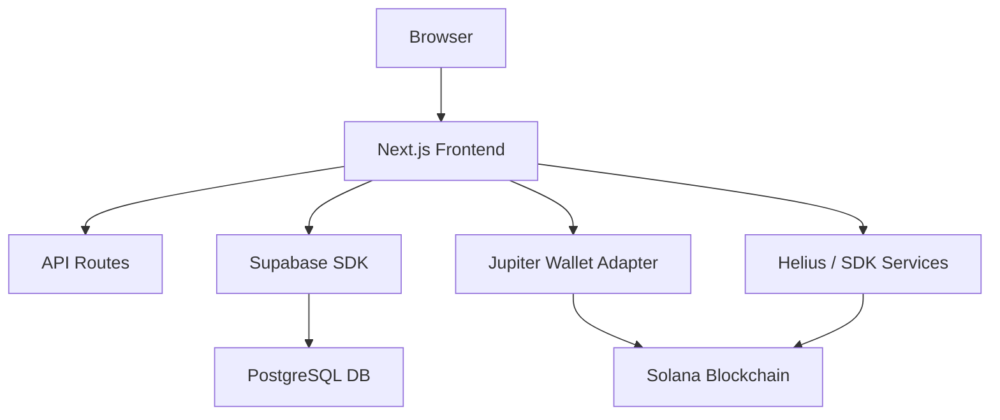

# Deriverse Architecture Documentation

## System Overview

Deriverse is a trading analytics platform built on Next.js that provides comprehensive analysis of Solana blockchain trading activity. It integrates real-time blockchain data with persistent storage to offer personalized trading journals.

## Architecture Flow



## Component Architecture

### Frontend Layer
```
src/
├── app/                    # Next.js App Router
├── components/            # React components
│   ├── features/         # Feature-specific logic (Home, Journal, Trades)
│   ├── layout/           # Structural components
│   └── ui/               # Atomic UI components (Modals, Buttons)
├── lib/                  # Utilities & Hooks
│   ├── hooks/            # useWalletConnection
│   ├── constants.ts      # App-wide config
│   └── tradeFilters.ts   # Filtering logic
├── services/             # API & DB Clients
│   ├── SupabaseWalletService.ts
│   ├── SupabaseTradeService.ts
│   ├── HeliusService.ts
│   └── DeriverseTradeService.ts
└── providers.tsx         # Context & Wallet Providers
```

## Data Flow Patterns

### 1. Unified Connection Flow
1. **Connect**: User triggers Jupiter Wallet Adapter.
2. **Verify**: `SupabaseWalletService` checks if the wallet exists.
3. **Register**: New users are guided through `NewUserModal` for registration.
4. **Active**: App state switches to 'devnet' mode for real data.

### 2. Data Modes
- **Mock Mode**: Uses local `mockData.ts` for rapid UI testing and exploration.
- **Real Mode (Devnet)**: Fetched from Solana via Helius/Deriverse SDK and persisted/retrieved from Supabase.

## Technology Stack

### Core
- **Next.js 16 (App Router)**: Framework
- **React 19**: UI Library
- **TypeScript**: Type Safety

### Infrastructure
- **Supabase**: PostgreSQL, Auth, and Real-time Persistence
- **Solana Web3.js**: Blockchain interaction
- **Jupiter Wallet Adapter**: Unified wallet connection

### Styling & UI
- **TailwindCSS**: Styling
- **Framer Motion**: Animations
- **Geist Fonts**: Unified typography system
- **Recharts**: Data visualization

## State Management

### Connection State
Managed via `useWalletConnection` hook which wraps the Jupiter adapter and provides `walletAddress`, `connected`, and `isWalletModalOpen` states.

### Persistence Strategy
- **User Wallets**: Stored in Supabase for cross-device persistence.
- **Trades**: Locally filtered and optionally saved to Supabase for persistent analytics.

## Deployment & Security
- **Local Development**: Next.js dev server with `.env.local` for sensitive keys.
- **Supabase Policies**: Row Level Security (RLS) ensures users only access their own data.
- **JWT**: Secure communication between frontend and Supabase.

---
This document is updated as of February 2026 to reflect the current feature-set and infrastructure.
