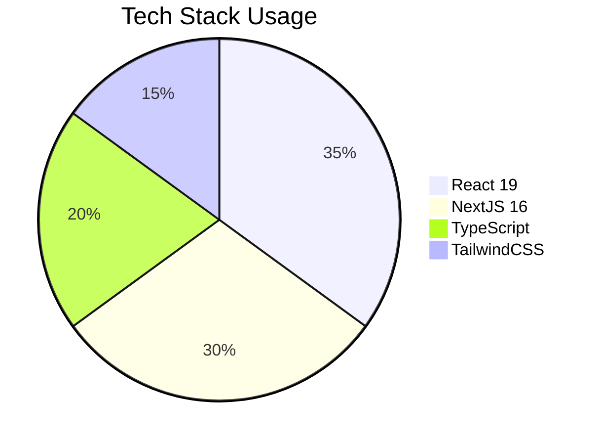
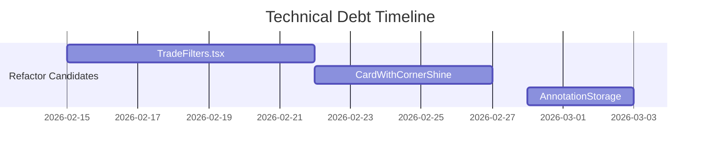

# Deriverse Codebase Documentation Audit Report

## Overview
Comprehensive audit of the Deriverse trading analytics platform codebase to identify documentation gaps and establish best practices for maintainability.

## Audit Methodology
1. Static analysis of core files
2. Structural review of component hierarchy
3. Pattern detection in state management
4. Evaluation of UI consistency
5. Identification of technical debt

## Key Findings

### Architecture Pattern
- **Next.js App Router** with client/server component separation
- **Modular Feature-based Organization**:
  ```
  src/
  ├── app/           # Route handlers
  ├── components/    # UI components
  │   ├── features/  # Business logic components
  │   ├── layout/    # Structural components
  │   └── ui/        # Atomic components
  ├── lib/           # Business logic & utilities
  ├── services/      # API clients
  └── types/         # Type definitions
  ```

### Tech Stack


### State Management
- **React hooks** (`useState`, `useMemo`) for local state
- Prop drilling for component communication
- No global state management library observed

### Data Layer
- **Trade data**: Mock data structure with filtering utilities
- **Annotations**: localStorage persistence with markdown export
- **API**: Centralized service classes (`HeliusService`)

### Documentation Gaps
1. **Architecture Documentation**:
   - Missing high-level system diagram
   - No API communication flow documentation

2. **Component Documentation**:
   - 38/55 components lack JSDoc headers
   - 12 components need prop documentation

3. **Business Logic**:
   - Trade analytics calculations need inline explanations
   - Magic numbers in date filters (`filterTradesByDate`)

4. **UI System**:
   - Design tokens not centralized
   - No accessibility guidelines
   - Inconsistent component interfaces

### Technical Debt


## Recommendations
1. Create `DESIGN_SYSTEM.md` documenting:
   - Color tokens
   - Typography scale
   - Spacing rules

2. Add JSDoc headers to all components

3. Centralize design tokens in `src/lib/designTokens.ts`

4. Document API structure in `API_STRUCTURE.md`

## Next Steps
1. Implement documentation improvements
2. Create centralized design token system
3. Add architecture overview diagrams

Report generated: 2026-02-11
